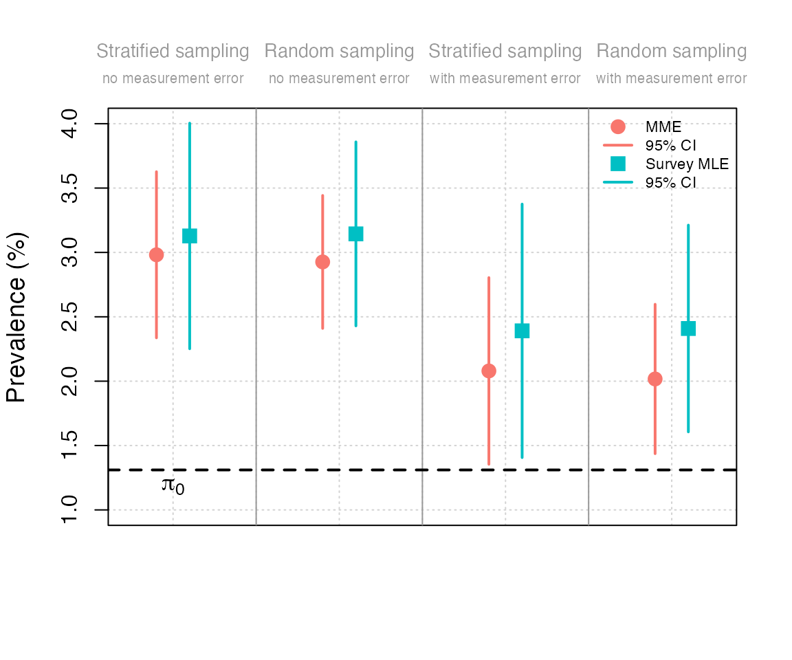
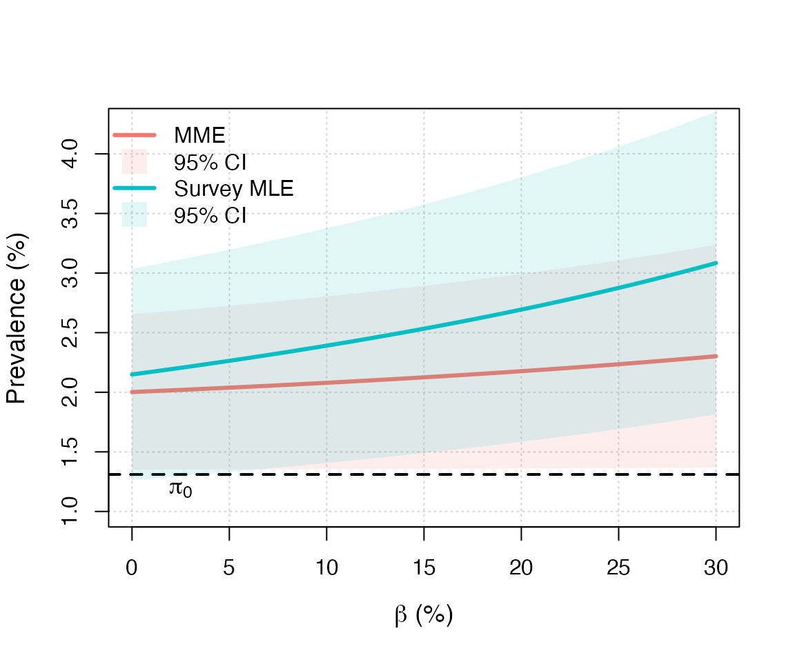

# Results Reproducibility

> 🏆 **2024 JASA Reproducibility Award.** This vignette is the material
> recognized by the *Journal of the American Statistical Association*
> with its 2024 Reproducibility Award. See the [JASA awardees
> page](https://jasa-acs.github.io/repro-award/awardees.html).

## Case study: Application to Austrian COVID-19 survey

We use the methodology developed in Guerrier et al. (2024) to estimate
COVID-19 prevalence from a survey conducted in November 2020 by
Statistics Austria (2020), and we compare the different estimators to
illustrate, in practice, the impact of choosing one method over another.

In November 2020, a survey sample of $`n=2287`$ was collected to test
for COVID-19 using PCR tests. Seventy-two participants tested positive;
of those, thirty-five ($`R_1=35`$) reported having been declared
positive by the official procedure during the same month. In November
there were $`93{,}914`$ declared cases among the approximately
$`7{,}166{,}167`$ Austrian inhabitants over 16 years old, so
$`\pi_0 \approx 1.3105\%`$. The sensitivity ($`1-\alpha`$) and
specificity ($`1-\beta`$) are not known with precision, so we present
estimates without misclassification error alongside estimates for
plausible FP/FN rates consistent with the sensitivities and
specificities reported in Kobokovich et al. (2020) and Surkova et al.
(2020).

The results presented in Table 2 of Guerrier et al. (2024) can be
reproduced as follows:

``` r

# Load pempi
library(pempi)

# Austrian data (November 2020)
pi0 = 93914/7166167

# Load data
data("covid19_austria")

# Random sampling
n = nrow(covid19_austria)
R1 = sum(covid19_austria$Y == 1 & covid19_austria$Z == 1)
R2 = sum(covid19_austria$Y == 0 & covid19_austria$Z == 1)
R3 = sum(covid19_austria$Y == 1 & covid19_austria$Z == 0)
R4 = sum(covid19_austria$Y == 0 & covid19_austria$Z == 0)

# Weighted sampling
R1w = sum(covid19_austria$weights[covid19_austria$Y == 1 & covid19_austria$Z == 1])
R2w = sum(covid19_austria$weights[covid19_austria$Y == 0 & covid19_austria$Z == 1])
R3w = sum(covid19_austria$weights[covid19_austria$Y == 1 & covid19_austria$Z == 0])
R4w = sum(covid19_austria$weights[covid19_austria$Y == 0 & covid19_austria$Z == 0])

# Print table
data_mat = matrix(c(R1w, R2w, R3w, R4w, R1, R2, R3, R4), 2, 4, byrow = TRUE)
rownames(data_mat) = c("Weighted sampling", "Unweighted sampling")
colnames(data_mat) = c("R1 (R11)", "R2 (R10)", "R3 (R01)", "R4 (R00)")
knitr::kable(round(data_mat, 4))
```

|                     | R1 (R11) | R2 (R10) | R3 (R01) | R4 (R00) |
|:--------------------|---------:|---------:|---------:|---------:|
| Weighted sampling   |  33.3589 |        0 |  38.2712 |  2218.37 |
| Unweighted sampling |  35.0000 |        0 |  37.0000 |  2218.00 |

The data can be summarized as follows:

- $`n`$ = 2290
- $`\pi_0`$ = 1.3105%
- $`R_{11}`$ = 35 (which is denoted as `R1` in the package).
- $`\bar{R}_{11}`$ = 33.3589 (which is denoted as `R1` or `R1w` in the
  package).
- $`R_{10}`$ = 0 (which is denoted as `R2` in the package).
- $`\bar{R}_{10}`$ = 0 (which is denoted as `R2` or `R2w` in the
  package).
- $`R_{01}`$ = 37 (which is denoted as `R3` in the package).
- $`\bar{R}_{01}`$ = 38.2712 (which is denoted as `R3` or `R3w` in the
  package).
- $`R_{00}`$ = 2218 (which is denoted as `R4` in the package).
- $`\bar{R}_{00}`$ = 2218.3698 (which is denoted as `R4` or `R4w` in the
  package).

We can check that $`R_{11} + R_{10} + R_{01} + R_{00} = n`$

``` r

R1 + R2 + R3 + R4
```

    ## [1] 2290

and $`\bar{R}_{11} + \bar{R}_{10} + \bar{R}_{01} + \bar{R}_{00} = n`$

``` r

R1w + R2w + R3w + R4w
```

    ## [1] 2290

For the analysis we consider the possibility of measurement error, in
which we use the following values:

``` r

# Measurement error
alpha0 = 0
alpha = 1/100
beta = 10/100
```

## Survey MLE

### Survey MLE with random sampling

The Survey MLE (with and without measurement error) can be computed as
follows and correspond to the numbers reported in Table 3 of Guerrier et
al. (2024):

``` r

# Survey MLE without measurement error
(smle_no_meas_error_random = survey_mle(R = R1 + R3, n = n))
```

    ## Method: Survey MLE
    ## 
    ## Estimated proportion: 3.1441%
    ## Standard error      : 0.3647%
    ## 
    ## Confidence intervals at the 95% level:
    ## Asymptotic Approach: 2.4294% - 3.8588%
    ## Clopper-Pearson    : 2.4680% - 3.9433%
    ## 
    ## Assumed measurement error: alpha = 0%, beta = 0% 
    ## Sampling: Random

``` r

# Survey MLE with measurement error (as defined above)
(smle_with_meas_error_random = survey_mle(R = R1 + R3, n = n, 
                              alpha = alpha, beta = beta))
```

    ## Method: Survey MLE
    ## 
    ## Estimated proportion: 2.4091%
    ## Standard error      : 0.4097%
    ## 
    ## Confidence intervals at the 95% level:
    ## Asymptotic Approach: 1.6060% - 3.2122%
    ## Clopper-Pearson    : 1.6495% - 3.3070%
    ## 
    ## Assumed measurement error: alpha = 1%, beta = 10% 
    ## Sampling: Random

### Survey MLE with stratified sampling

In the case of a stratified sampling, the Survey MLE (with and without
measurement error) can be computed as follows:

``` r

# Survey (weighted) MLE without measurement error
(smle_no_meas_error_strat = survey_mle(R = R1w + R3w, n = n, 
                            V = mean(covid19_austria$weights^2)))
```

    ## Method: Survey MLE
    ## 
    ## Estimated proportion: 3.1280%
    ## Standard error      : 0.4471%
    ## 
    ## Confidence interval at the 95% level:
    ## Asymptotic Approach: 2.2517% - 4.0042%
    ## 
    ## Assumed measurement error: alpha = 0%, beta = 0% 
    ## Sampling: Stratified with V = 1.51

``` r

# Survey MLE with measurement error (as defined above)
(smle_with_meas_error_strat = survey_mle(R = R1w + R3w, n = n,
                             alpha = alpha, beta = beta, 
                             V = mean(covid19_austria$weights^2)))
```

    ## Method: Survey MLE
    ## 
    ## Estimated proportion: 2.3910%
    ## Standard error      : 0.5023%
    ## 
    ## Confidence interval at the 95% level:
    ## Asymptotic Approach: 1.4064% - 3.3755%
    ## 
    ## Assumed measurement error: alpha = 1%, beta = 10% 
    ## Sampling: Stratified with V = 1.51

## Moment-based estimator

### Moment-based estimator with random sampling

In the case of a random sampling, the moment-based estimator or MME
(with and without measurement error) can be computed as follows:

``` r

# MME without measurement error
(mme_no_meas_error_random = moment_estimator(R3 = R3, n = n, 
                            pi0 = pi0))
```

    ## Method: Moment Estimator
    ## 
    ## Estimated proportion: 2.9262%
    ## Standard error      : 0.2635%
    ## 
    ## Confidence intervals at the 95% level:
    ## Asymptotic Approach: 2.4099% - 3.4426%
    ## Clopper-Pearson    : 2.4506% - 3.5308%
    ## 
    ## Assumed measurement error: alpha  = 0%, beta = 0%,
    ##                            alpha0 = 0% 
    ## 
    ## Estimated false negative rate of the
    ## official procedure: beta0 = 55.21%
    ## CI at the 95% level: 47.31% - 63.12%
    ## 
    ## Estimated ascertainment rate: 
    ## pi0/pi = 44.79%
    ## CI at the 95% level: 36.88% - 52.69%
    ## 
    ## Sampling: Random

``` r

# MME with measurement error (as defined above)
(mme_with_meas_error_random = moment_estimator(R3 = R3, n = n,
                              pi0 = pi0, alpha = alpha, 
                              beta = beta, alpha0 = alpha0))
```

    ## Method: Moment Estimator
    ## 
    ## Estimated proportion: 2.0171%
    ## Standard error      : 0.2960%
    ## 
    ## Confidence intervals at the 95% level:
    ## Asymptotic Approach: 1.4369% - 2.5973%
    ## Clopper-Pearson    : 1.4827% - 2.6963%
    ## 
    ## Assumed measurement error: alpha  = 1%, beta = 10%,
    ##                            alpha0 = 0% 
    ## 
    ## Estimated false negative rate of the
    ## official procedure: beta0 = 35.03%
    ## CI at the 95% level: 16.34% - 53.72%
    ## 
    ## Estimated ascertainment rate: 
    ## pi0/pi = 64.97%
    ## CI at the 95% level: 46.28% - 83.66%
    ## 
    ## Sampling: Random

### Moment-based estimator with stratified sampling

In the case of a stratified sampling, the MME (with and without
measurement error) can be computed as follows and correspond to the
numbers reported in Table 3 of Guerrier et al. (2024):

``` r

# MME without measurement error
(mme_no_meas_error_strat = moment_estimator(R3 = R3w, n = n,
                          pi0 = pi0,
                          V = mean(covid19_austria$weights^2)))
```

    ## Method: Moment Estimator
    ## 
    ## Estimated proportion: 2.9818%
    ## Standard error      : 0.3292%
    ## 
    ## Confidence interval at the 95% level:
    ## Asymptotic Approach: 2.3365% - 3.6270%
    ## 
    ## Assumed measurement error: alpha  = 0%, beta = 0%,
    ##                            alpha0 = 0% 
    ## 
    ## Estimated false negative rate of the
    ## official procedure: beta0 = 56.05%
    ## CI at the 95% level: 46.54% - 65.56%
    ## 
    ## Estimated ascertainment rate: 
    ## pi0/pi = 43.95%
    ## CI at the 95% level: 34.44% - 53.46%
    ## 
    ## Sampling: Stratified with V = 1.51

``` r

# MME with measurement error (as defined above)
(mme_with_meas_error_strat = moment_estimator(R3 = R3w, n = n,
                             pi0 = pi0, alpha = alpha, beta = beta,
                             alpha0 = alpha0, 
                             V = mean(covid19_austria$weights^2)))
```

    ## Method: Moment Estimator
    ## 
    ## Estimated proportion: 2.0794%
    ## Standard error      : 0.3699%
    ## 
    ## Confidence interval at the 95% level:
    ## Asymptotic Approach: 1.3544% - 2.8045%
    ## 
    ## Assumed measurement error: alpha  = 1%, beta = 10%,
    ##                            alpha0 = 0% 
    ## 
    ## Estimated false negative rate of the
    ## official procedure: beta0 = 36.98%
    ## CI at the 95% level: 15.00% - 58.95%
    ## 
    ## Estimated ascertainment rate: 
    ## pi0/pi = 63.02%
    ## CI at the 95% level: 41.05% - 85.00%
    ## 
    ## Sampling: Stratified with V = 1.51

## Conditional MLE

### Conditional MLE with random sampling

In the case of a random sampling, the conditional MLE or CMLE (with and
without measurement error) can be computed as follows:

``` r

# CMLE without measurement error
(cmle_no_meas_error_random = conditional_mle(R1 = R1, R2 = R2, 
                            R3 = R3, R4 = R4, pi0 = pi0))
```

    ## Method: Conditional MLE
    ## 
    ## Estimated proportion: 2.9317%
    ## Standard error      : 0.2639%
    ## 
    ## Confidence interval at the 95% level:
    ## Asymptotic Approach: 2.4145% - 3.4489%
    ## 
    ## Assumed measurement error: alpha  = 0%, beta = 0%,
    ##                            alpha0 = 0% 
    ## 
    ## Estimated false negative rate of the
    ## official procedure: beta0 = 55.30%
    ## CI at the 95% level: 47.41% - 63.18%
    ## 
    ## Estimated ascertainment rate: 
    ## pi0/pi = 44.70%
    ## CI at the 95% level: 36.82% - 52.59%
    ## 
    ## Sampling: Random

``` r

# CMLE with measurement error (as defined above)
(cmle_with_meas_error_random = conditional_mle(R1 = R1, R2 = R2, 
                              R3 = R3, R4 = R4, pi0 = pi0, 
                              alpha = alpha, beta = beta, 
                              alpha0 = alpha0))
```

    ## Method: Conditional MLE
    ## 
    ## Estimated proportion: 2.0200%
    ## Standard error      : 0.2962%
    ## 
    ## Confidence interval at the 95% level:
    ## Asymptotic Approach: 1.4394% - 2.6006%
    ## 
    ## Assumed measurement error: alpha  = 1%, beta = 10%,
    ##                            alpha0 = 0% 
    ## 
    ## Estimated false negative rate of the
    ## official procedure: beta0 = 35.12%
    ## CI at the 95% level: 16.48% - 53.77%
    ## 
    ## Estimated ascertainment rate: 
    ## pi0/pi = 64.88%
    ## CI at the 95% level: 46.23% - 83.52%
    ## 
    ## Sampling: Random

### Conditional MLE with stratified sampling

In the case of a stratified sampling, the CMLE (with and without
measurement error) can be computed as follows:

``` r

# CMLE without measurement error
(cmle_no_meas_error_strat = conditional_mle(R1 = R1w, R2 = R2w, 
                            R3 = R3w, R4 = R4w, pi0 = pi0, 
                            V = mean(covid19_austria$weights^2)))
```

    ## Method: Conditional MLE
    ## 
    ## Estimated proportion: 2.9841%
    ## Standard error      : 0.3294%
    ## 
    ## Confidence interval at the 95% level:
    ## Asymptotic Approach: 2.3385% - 3.6297%
    ## 
    ## Assumed measurement error: alpha  = 0%, beta = 0%,
    ##                            alpha0 = 0% 
    ## 
    ## Estimated false negative rate of the
    ## official procedure: beta0 = 56.08%
    ## CI at the 95% level: 46.58% - 65.59%
    ## 
    ## Estimated ascertainment rate: 
    ## pi0/pi = 43.92%
    ## CI at the 95% level: 34.41% - 53.42%
    ## 
    ## Sampling: Stratified with V = 1.51

``` r

# CMLE with measurement error (as defined above)
(cmle_with_meas_error_strat = conditional_mle(R1 = R1w, R2 = R2w, 
                              R3 = R3w, R4 = R4w, n = n, pi0 = pi0,
                              alpha = alpha, beta = beta, 
                              alpha0 = alpha0, 
                              V = mean(covid19_austria$weights^2)))
```

    ## Method: Conditional MLE
    ## 
    ## Estimated proportion: 2.0831%
    ## Standard error      : 0.3702%
    ## 
    ## Confidence interval at the 95% level:
    ## Asymptotic Approach: 1.3574% - 2.8087%
    ## 
    ## Assumed measurement error: alpha  = 1%, beta = 10%,
    ##                            alpha0 = 0% 
    ## 
    ## Estimated false negative rate of the
    ## official procedure: beta0 = 37.09%
    ## CI at the 95% level: 15.17% - 59.00%
    ## 
    ## Estimated ascertainment rate: 
    ## pi0/pi = 62.91%
    ## CI at the 95% level: 41.00% - 84.83%
    ## 
    ## Sampling: Stratified with V = 1.51

## Marginal MLE

### Marginal MLE with random sampling

In the case of a random sampling, the marginal MLE or MMLE (with and
without measurement error) can be computed as follows:

``` r

# MMLE without measurement error
(mmle_no_meas_error_random = marginal_mle(R1 = R1, R3 = R3, n = n, pi0 = pi0))
```

    ## Method: Marginal MLE
    ## 
    ## Estimated proportion: 2.9317%
    ## Standard error      : 0.2639%
    ## 
    ## Confidence interval at the 95% level:
    ## Asymptotic Approach: 2.4145% - 3.4489%
    ## 
    ## Assumed measurement error: alpha  = 0%, beta = 0%,
    ##                            alpha0 = 0% 
    ## 
    ## Estimated false negative rate of the
    ## official procedure: beta0 = 55.30%
    ## CI at the 95% level: 47.41% - 63.18%
    ## 
    ## Estimated ascertainment rate: 
    ## pi0/pi = 44.70%
    ## CI at the 95% level: 36.82% - 52.59%
    ## 
    ## Sampling: Random

``` r

# MMLE with measurement error (as defined above)
(mmle_with_meas_error_random  = marginal_mle(R1 = R1, R3 = R3, n = n, pi0 = pi0, alpha = alpha, beta = beta, alpha0 = alpha0))
```

    ## Method: Marginal MLE
    ## 
    ## Estimated proportion: 2.0200%
    ## Standard error      : 0.2962%
    ## 
    ## Confidence interval at the 95% level:
    ## Asymptotic Approach: 1.4394% - 2.6006%
    ## 
    ## Assumed measurement error: alpha  = 1%, beta = 10%,
    ##                            alpha0 = 0% 
    ## 
    ## Estimated false negative rate of the
    ## official procedure: beta0 = 35.12%
    ## CI at the 95% level: 16.48% - 53.77%
    ## 
    ## Estimated ascertainment rate: 
    ## pi0/pi = 64.88%
    ## CI at the 95% level: 46.23% - 83.52%
    ## 
    ## Sampling: Random

### Marginal MLE with stratified sampling

The MMLE is currently not implemented in the case of a stratified
sampling.

## Replicating Table 3

Table 3 can be replicated as follows:

``` r

table2 = matrix(NA, 6, 6)
rownames(table2) = c("SMLE (stratified)", "MME (stratified)", "Estimated beta0 (stratified)", "SMLE (random)", "MME (random)", "Estimated beta0 (random)")
colnames(table2) = c("Estimates (no meas. err.)", "95% CI (low)", "95% CI (high)", "Estimates (with meas. err.)", "95% CI (low)", "95% CI (high)")

table2[1, ] = 100*c(smle_no_meas_error_strat$estimate,
                smle_no_meas_error_strat$ci_asym,
                smle_with_meas_error_strat$estimate,
                smle_with_meas_error_strat$ci_asym) 

table2[2, ] = 100*c(mme_no_meas_error_strat$estimate,
                mme_no_meas_error_strat$ci_asym,
                mme_with_meas_error_strat$estimate,
                mme_with_meas_error_strat$ci_asym) 

table2[3, ] = 100*c(mme_no_meas_error_strat$beta0,
                mme_no_meas_error_strat$ci_beta0,
                mme_with_meas_error_strat$beta0,
                mme_with_meas_error_strat$ci_beta0)

table2[4, ] = 100*c(smle_no_meas_error_random$estimate,
                smle_no_meas_error_random$ci_asym,
                smle_with_meas_error_random$estimate,
                smle_with_meas_error_random$ci_asym)

table2[5, ] = 100*c(mme_no_meas_error_random$estimate,
                mme_no_meas_error_random$ci_asym,
                mme_with_meas_error_random$estimate,
                mme_with_meas_error_random$ci_asym) 
table2[6, ] = 100*c(mme_no_meas_error_random$beta0,
                mme_no_meas_error_random$ci_beta0,
                mme_with_meas_error_random$beta0,
                mme_with_meas_error_random$ci_beta0)

knitr::kable(round(table2, 3))
```

|  | Estimates (no meas. err.) | 95% CI (low) | 95% CI (high) | Estimates (with meas. err.) | 95% CI (low) | 95% CI (high) |
|:---|---:|---:|---:|---:|---:|---:|
| SMLE (stratified) | 3.128 | 2.252 | 4.004 | 2.391 | 1.406 | 3.375 |
| MME (stratified) | 2.982 | 2.336 | 3.627 | 2.079 | 1.354 | 2.804 |
| Estimated beta0 (stratified) | 56.049 | 46.537 | 65.560 | 36.977 | 15.003 | 58.951 |
| SMLE (random) | 3.144 | 2.429 | 3.859 | 2.409 | 1.606 | 3.212 |
| MME (random) | 2.926 | 2.410 | 3.443 | 2.017 | 1.437 | 2.597 |
| Estimated beta0 (random) | 55.215 | 47.312 | 63.118 | 35.028 | 16.339 | 53.718 |

## Comparing prevalence

This figure can be obtained by running the file
`pempi/figures/case_study.Rnw`. A similar base R version can be obtained
as follows:

``` r

pi0 = 93914/7166167
cols = c("#F8766DFF", "#00BFC4FF")
delta = 0.1
cex_pt = 1.5
lwd_ci = 2
pch_mme = 16
pch_smle = 15

plot(NA, xlim = c(0.75, 4.25), ylim = c(1, 4), axes = FALSE, ann = FALSE)
grid()
box()
col_text = "grey60"
cex_text = 0.85
cex_text2 = 0.65
abline(v = c(1.5, 2.5, 3.5), col = col_text)

axis(2)

mtext("Stratified sampling", side = 3, line = 1.75, cex = cex_text, at = 1, col = col_text)
mtext("no measurement error", side = 3, line = 0.75, cex = cex_text2, at = 1, col = col_text)

mtext("Random sampling", side = 3, line = 1.75, cex = cex_text, at = 2, col = col_text)
mtext("no measurement error", side = 3, line = 0.75, cex = cex_text2, at = 2, col = col_text)

mtext("Stratified sampling", side = 3, line = 1.75, cex = cex_text, at = 3, col = col_text)
mtext("with measurement error", side = 3, line = 0.75, cex = cex_text2, at = 3, col = col_text)

mtext("Random sampling", side = 3, line = 1.75, cex = cex_text, at = 4, col = col_text)
mtext("with measurement error", side = 3, line = 0.75, cex = cex_text2, at = 4, col = col_text)

mtext("Prevalence (%)", side = 2, line = 3, cex = 1.15)
abline(h = 100*pi0, lwd = 2, lty = 2)

text(1, 1.18, expression(pi[0]), cex = 1.15)

legend("topright", c("MME", "95% CI",
                    "Survey MLE", "95% CI"),
       bty = "n", col = c(cols[1], cols[1], cols[2], cols[2]),
       lwd = c(NA, lwd_ci, NA, lwd_ci), pch = c(pch_mme, NA, pch_smle, NA),
       pt.cex = 1.5, cex = 0.7)

# 1) Stratified sampling, without ME
points(1 - delta, 100*mme_no_meas_error_strat$estimate, col = cols[1], pch = pch_mme, cex = cex_pt)
lines(c(1, 1) - delta, 100*mme_no_meas_error_strat$ci_asym, col = cols[1], lwd = lwd_ci)

points(1 + delta, 100*smle_no_meas_error_strat$estimate, col = cols[2], pch = pch_smle, cex = cex_pt)
lines(c(1, 1) + delta, 100*smle_no_meas_error_strat$ci_asym, col = cols[2], lwd = lwd_ci)

# 2) Random sampling, without ME
points(2 - delta, 100*mme_no_meas_error_random$estimate, col = cols[1], pch = pch_mme, cex = cex_pt)
lines(c(2, 2) - delta, 100*mme_no_meas_error_random$ci_asym, col = cols[1], lwd = lwd_ci)

points(2 + delta, 100*smle_no_meas_error_random$estimate, col = cols[2], pch = pch_smle, cex = cex_pt)
lines(c(2, 2) + delta, 100*smle_no_meas_error_random$ci_asym, col = cols[2], lwd = lwd_ci)

# 3) Stratified sampling, with ME
points(3 - delta, 100*mme_with_meas_error_strat$estimate, col = cols[1], pch = pch_mme, cex = cex_pt)
lines(c(3, 3) - delta, 100*mme_with_meas_error_strat$ci_asym, col = cols[1], lwd = lwd_ci)

points(3 + delta, 100*smle_with_meas_error_strat$estimate, col = cols[2], pch = pch_smle, cex = cex_pt)
lines(c(3, 3) + delta, 100*smle_with_meas_error_strat$ci_asym, col = cols[2], lwd = lwd_ci)

# 4) Random sampling, with ME
points(4 - delta, 100*mme_with_meas_error_random$estimate, col = cols[1], pch = pch_mme, cex = cex_pt)
lines(c(4, 4) - delta, 100*mme_with_meas_error_random$ci_asym, col = cols[1], lwd = lwd_ci)

points(4 + delta, 100*smle_with_meas_error_random$estimate, col = cols[2], pch = pch_smle, cex = cex_pt)
lines(c(4, 4) + delta, 100*smle_with_meas_error_random$ci_asym, col = cols[2], lwd = lwd_ci)
```



## Replicating Figure 1

Figure 1 can be obtained by running the file
`pempi/figures/case_study.Rnw`. A similar base R version can be obtained
as follows:

``` r

# Assumptions
pi0 = 93914/7166167
alpha = 1/100
alpha0 = 0
m = 300
beta = seq(from = 0, to = 30, length.out = m)/100
res_moment = res_smle = matrix(NA, m, 3)
V = mean(covid19_austria$weights^2)

for (i in 1:m){
  # Moment estimator
  inter = moment_estimator(R3 = R3w, n = n, pi0 = pi0,
                           alpha = alpha, alpha0 = alpha0,
                           beta = beta[i], V = V)

  res_moment[i,] = c(inter$estimate, inter$ci_asym)

  # Survey MLE
  inter = survey_mle(R = R1w + R3w, n = n, pi0 = pi0,
                     alpha = alpha, alpha0 = alpha0,
                     beta = beta[i], V = V)

  res_smle[i,] = c(inter$estimate, inter$ci_asym)
}

cols = c("#F8766DFF", "#00BFC4FF")
cols2 = c("#F8766D1F", "#00BFC41F")

plot(NA, xlim = 100*range(beta), ylim = c(1, 4.25), axes = FALSE, ann = FALSE)
grid()
box()
axis(1)
axis(2)
mtext(expression(paste(beta, " (%)")), side = 1, line = 3, cex = 1.15)
mtext("Prevalence (%)", side = 2, line = 3, cex = 1.15)
abline(h = 100*pi0, lwd = 2, lty = 2)
abline(h = 100*pi0, lwd = 2, lty = 2)

text(2.5, 1.18, expression(pi[0]), cex = 1.15)

legend("topleft", c("MME", "95% CI",
                    "Survey MLE", "95% CI"),
       bty = "n", col = c(cols[1], cols2[1],cols[2], cols2[2]),
       lwd = c(3, NA, 3, NA), pch = c(NA, 15, NA, 15),
       pt.cex = 2.5)
lines(100*beta, 100*res_moment[,1], lwd = 3, col = cols[1])
polygon(100*c(beta, rev(beta)),
        100*c(res_moment[,2], rev(res_moment[,3])),
        col = cols2[1], border = NA)

lines(100*beta, 100*res_smle[,1], lwd = 3, col = cols[2])
polygon(100*c(beta, rev(beta)),
        100*c(res_smle[,2], rev(res_smle[,3])),
        col = cols2[2], border = NA)
```



## Simulation Study

The results summarized in Section 5 Guerrier et al. (2024) can be
replicated as follows:

1.  Run the file `pempi/simulations/simulation_script.R` which should
    take a couple of hours on a standard laptop (with $`5 \times 10^4`$
    Monte Carlo replications). This allows to generate the file
    `pempi/simulations/simulations.RData`.
2.  Run the file `pempi/simulations/figures.Rnw` (which reads
    `pempi/simulations/simulations.RData`) to generate the figures
    associated to our simulation study.

## References

Guerrier, Stéphane, Christoph Kuzmics, and Maria-Pia Victoria-Feser.
2024. “Assessing COVID-19 Prevalence in Austria with Infection Surveys
and Case Count Data as Auxiliary Information.” *Journal of the American
Statistical Association* 119 (547): 1722–35.
<https://doi.org/10.1080/01621459.2024.2313790>.

Kobokovich, A., R. West, and G. Gronvall. 2020. *Serology-Based Tests
for COVID-19*. Center for Health Security, Bloomberg School of Public
Health, John Hopkins University.
<https://www.centerforhealthsecurity.org/resources/COVID-19/serology/Serology-based-tests-for-COVID-19.html>.

Statistics Austria. 2020. *Prävalenz von SARS-CoV-2-Infektionen liegt
bei 3,1%*.

Surkova, Elena, Vladyslav Nikolayevskyy, and Francis Drobniewski. 2020.
“False-Positive COVID-19 Results: Hidden Problems and Costs.” *The
Lancet Respiratory Medicine* 8 (12): 1167–68.
